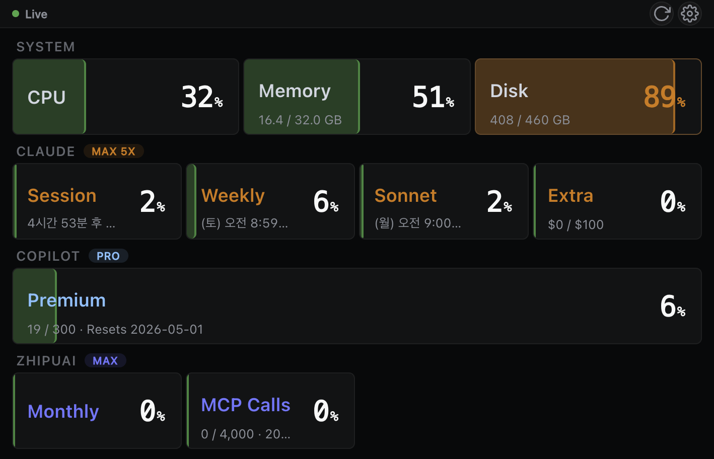

# Agentic Dev Gauge

A real-time dashboard for monitoring system resources and AI coding agent quota usage at a glance. Built for developers who use multiple AI coding assistants (Claude, GitHub Copilot, ZhipuAI) and need to keep an eye on their usage limits.



## What It Monitors

### System Resources
- **CPU** usage percentage
- **Memory** usage with GB breakdown
- **Disk** usage with capacity info

### AI Coding Agent Quotas
- **Claude** (via CDP scraping) — Session (5h rolling), Weekly, Sonnet, Extra ($) usage
- **GitHub Copilot** (via internal API) — Premium request quota with reset date
- **ZhipuAI GLM** (via REST API) — Monthly token usage and MCP tool call quota

All metrics update in real-time via WebSocket with color-coded warning (orange at 80%) and critical (red at 90%) thresholds.

## Quick Start

### Prerequisites
- Python 3.12+
- Google Chrome (for Claude CDP scraping)
- `gh` CLI authenticated (for Copilot quota — `gh auth login`)

### Install & Run

```bash
git clone https://github.com/jaydenchoe/openclaw_tiny_monitor.git
cd openclaw_tiny_monitor
python -m venv .venv && source .venv/bin/activate
pip install -r requirements.txt

# Configure API keys (optional)
cp .env.example .env
# Edit .env with your ZhipuAI API key

# Start the server
python -m src.main
```

The dashboard opens automatically in Chrome app mode (no address bar) at `http://localhost:8080`.

## Configuration

### Environment Variables (`.env`)

| Variable | Description |
|----------|-------------|
| `ZHIPUAI_API_KEY` | ZhipuAI API key for GLM quota monitoring |
| `THRESHOLDS` | JSON array of warning/critical thresholds |
| `OPENCLAW_GATEWAY_URL` | OpenClaw Gateway URL for alert notifications |
| `OPENCLAW_API_KEY` | OpenClaw Gateway API key |

### Settings UI

Click the gear icon in the dashboard to configure:
- API keys
- Warning/critical thresholds for system metrics and LLM usage
- OpenClaw Gateway connection

## Architecture

Built on **Hexagonal Architecture** (Ports & Adapters):

```
src/
  core/          # Domain models, Port (ABC) interfaces
  services/      # MonitorService, UsageService, AlertService
  adapters/      # Implementations: system/, ai_usage/, notification/
  api/           # REST routes, WebSocket endpoints
  static/        # Frontend (vanilla JS + CSS, no framework)
```

### Data Sources

| Provider | Method | Auth |
|----------|--------|------|
| Claude | Chrome DevTools Protocol (CDP) scraping | Browser login session |
| Copilot | `api.github.com/copilot_internal/user` | `gh auth token` (automatic) |
| ZhipuAI | REST API `/api/monitor/usage/quota/limit` | API key |
| System | psutil (cross-platform) | None |

### Tech Stack
- **Backend**: Python, FastAPI, uvicorn, pydantic-settings
- **Frontend**: Vanilla JS + CSS (no framework)
- **System metrics**: psutil
- **Real-time**: WebSocket
- **HTTP client**: httpx (async)

## Features

- Real-time WebSocket streaming (2s system metrics, 60s usage updates)
- Chrome `--app` mode auto-launch for clean fullscreen display
- Duplicate window detection (won't open twice on server restart)
- Configurable warning/critical thresholds via Settings UI
- Alert notifications via OpenClaw Gateway
- Responsive layout optimized for dedicated mini monitors (960x540)

## License

MIT
